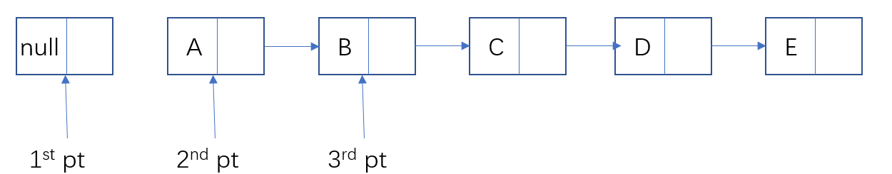
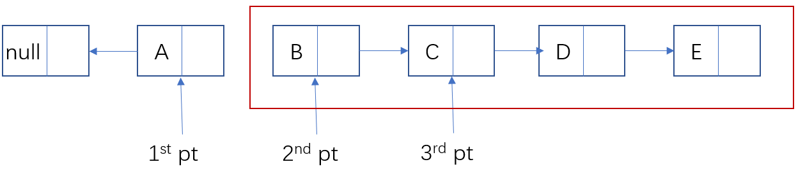
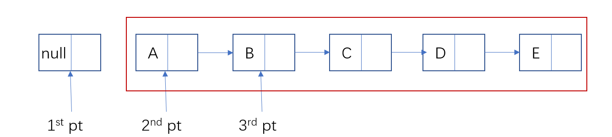
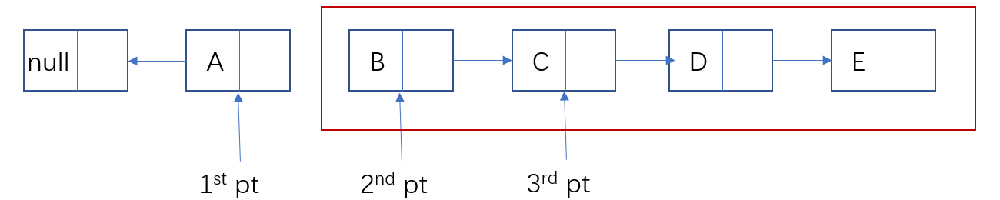
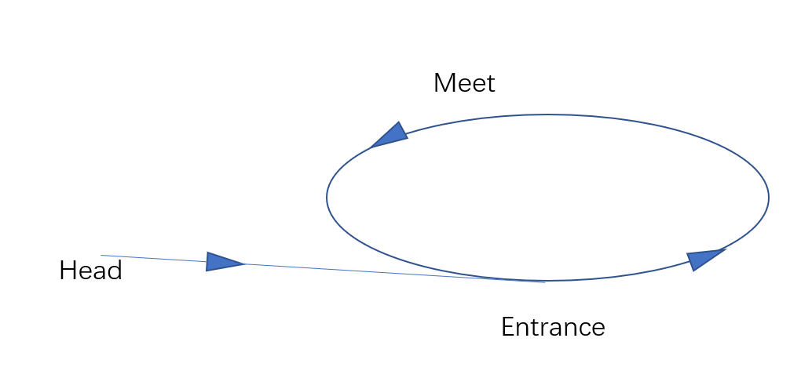

## 数据结构之链表

&emsp;&emsp;在数据结构中，我们最先接触到的就是顺序表了。顺序表又存在两种存储中介——数组和链表这两种。数组在存储数据来说，主要是存取快，但是对在指定的位置插入指定的元素来说，数组就稍微显得有些吃力了，于是链表的出现就是为了解决这个问题，采用的数据结构是，一个数据块，另外一个是指针域指向下一个结点。这样的数据结构对于插入、删除都十分的友好，但是对于查找就比较吃力了。

&emsp;&emsp;上面说了一些关于数组和链表的两种数据结构的优缺点，因为在链表中含有指针，因此这方面的试题特别容易受到面试官的青睐。以下是我总结的一些关于链表的面试题，我将对每一道题进行分析与解释。如有错误，欢迎大家指正。

### 一、寻找链表中倒数第K位的数

> 题目描述：
>
> 存在一个单链表，求出该链表的倒数第k位数。并输出他的值

【思路一】在这个题目当中，我们首先脑中的印象差不多应该是（这里说的是第一大致思路）——首先拿一个指针，在知道链表的长度之后，然后使用一个指针进行$n - k$  查找就能找到倒数第K位的数。

&emsp;&emsp;以上的思路没有问题，但是这种情况之下需要提前知道链表的长度。如果是自建链表那还好说，在建立链表的同时能够同时将链表的长度记录下来，然后采用以上的思路是丝毫问题都没有的。但是有可能由于一些原因的限制，我们事先无法得知链表的具体长度，在这种情况之下，仍然采用这种思路就仿佛有点不大好了。——首先我们需要遍历一遍得知链表的长度；另一方面，我们还需要再次遍历一次得到链表中倒数第$k$个数字，这对于我们程序员来说，这个时间还是比较不能容忍的。因此有没有更好的一种方式来完成这个任务呢？

&emsp;&emsp;即然我们希望避免无谓的遍历，那么我们就应当进行一些思考——如果需要寻找链表中倒数第$k$位数，那么除开，直接遍历，我们是不是还有其他的方法呢？比如**间隔相等**什么的思路，这样想来，我们便有了第二种思路

【思路二】设置两个指针，其中一个比另一个先走$k$步，那么当先走的那个到达最后的链表尾的时候，后走的指针指向的恰好就是倒数第$k$位数。

&emsp;&emsp;根据这种思路写下以下的代码：

```c++
int find_kth_num(LinkList* list, int k)
{
    if (list == nullptr || list -> length() < k)
    {
        return -1;
    }

    Node* pre_pt = list -> getHead();

    int i = 0;
    for (; i < k - 1; ++ i)
    {
        pre_pt = pre_pt -> getNext();
    }

    Node* post_pt = list -> getHead();

    while (pre_pt -> getNext() != nullptr)
    {
        pre_pt = pre_pt -> getNext();
        post_pt = post_pt -> getNext();
    }

    return post_pt -> getValue();
}
```

&emsp;&emsp;下面是我的类定义，

```c++
class Node{
    friend class LinkList;
    private:
        int     data;
        Node*   next;
    public:
        Node();
        Node(int val);
        Node(Node* T);
        ~Node();
        Node* getNext();
        int getValue();
        void setNext(Node*);
};

class LinkList
{
private:
    Node* head;
    Node* rear;
public:
    LinkList();
    ~LinkList();

    int  length();
    void creatFront();
    void creatRear();
    void traverse();
    Node* getHead();
};
```

【题外话】这道题的思路这样做没有问题，那么相当于我们已经把大的框架已经完成了。因此我们剩下的工作就是对一些**边界情况**和**特殊的输入**考虑。就如我上面代码中的，如果输入的链表本来就是$nullptr$或者链表长度本来没有$k$那么长，应当怎么处理，这些都应在考虑范围内。


### 二、反转链表

> 题目描述：
>
> 给定一个已知链表，要求将这个链表进行翻转，并返回反转后的链表的头节点。

【思路一】二话不用说，我想大家看到这个题目，在读完题目的那一瞬间估计已经想出了一种解决方案。不就是需要反转吗？什么数据结构能够对数据进行翻转？——**栈**！所以我们直接遍历一遍原链表，并将原链表中的数据依次输入到栈中，然后在遍历一次链表，将栈中的数据再次赋值给原链表。这样就很快的完成了题目的要求。

&emsp;&emsp;这个思路没有任何问题，但是我们在进行以上的操作的时候，另外开辟了$O(n)$的栈空间，这就不是很妙了。然后我们接着想一想，有没有什么办法能够使得我们根本不用开辟新的空间，直接在原始的空间上就能完成呢？于是我们进行以下的分析：不是需要将指针反转吗？那么我们就需要至少以下的三个指针：



<center><font size="2pt">图一：反转链表——最初状态</font></center>

&emsp;&emsp;接下来怎么办呢，就是按照反转的思路进行就好了：这就是我们期望看到的移动后的结果。



<center><font size="2pt">图二：反转链表——第二状态</font></center>

&emsp;&emsp;那么以上的从图一到图二经过了那些过程呢？

> 事实上，从图一到图二发生的事情就是——
>
> $2^{nd} pt \rightarrow next = 1^{st}pt\\1^{st} pt= 2^{nd}pt\\2^{nd}pt = 3^{rd}pt\\3^{rd}pt = 2^{nd}\rightarrow next$

&emsp;&emsp;因此我们来判断以下程序终止的条件——就是当$2^{nd}pt = nullptr || 2^{nd} \rightarrow next = nullptr$时，这样就完成了反转。

&emsp;&emsp;于是我们根据以上的过程写出以下的代码：

```c++
Node* revevrse_list(LinkList* list)
{
    if (list == nullptr)
    {
        return nullptr;
    }

    Node* first_pt = nullptr, *second_pt = list -> getHead(), *third_pt = nullptr;

    while (second_pt != nullptr)
    {
        third_pt = second_pt -> getNext();
        second_pt -> setNext(first_pt);
        first_pt = second_pt;
        second_pt = third_pt;
 
    }

    return first_pt;
}
```

【思路三】借助以上的思路，我们上述采用的方式是迭代法，我们是否可以采用递归的方法来解决这个问题么？那么从现在开始我们就开始研究怎样使用递归法完成这个算法。



<center><font size="2pt">图三：递归法的初始状态</font></center>

&emsp;&emsp;图三显示了红框中的部分是假设待处理的一些数据，红框外的是已经处理好的。我们画出之后的一个过程如图四。



<center><font size="2pt">图四：递归法的第二个过程</font></center>

&emsp;&emsp;从以上的两幅图的转变来看，我们记递归函数为$ReverseLink(Node*  node)$ ，因此从初始状态到第一状态，除开递归之外，剩下还需要做的是将结点$B$的$next$指针域指向结点$A$，同时将结点$A$的$next$指针域指向$nullptr$。 

&emsp;&emsp;考虑边界条件，当我们递归函数中结点为$nullptr$或者结点的$next$指针域指向$nullptr$的时候，我们停止递归操作。基于以上的思想，我们可以写出以下的代码：

```c++
Node* revevrse_list_recursive(Node* root)
{
    Node* rootNode;
    // 停止递归的条件
    if (root == nullptr || root -> getNext() == nullptr)
    {
        return root;
    }
    rootNode = revevrse_list_recursive(root -> getNext());

    root -> getNext() -> setNext(root);
    root -> setNext(nullptr);

    return rootNode;
}
```

【题外话】从这里我们可以学习到一种设计递归算法的操作，就是把待递归的结构当成一个整体，不必考虑其中的细节问题，从而在整体与整体之间构建联系。

### 三、判断链表是否成环

> 题目描述：
>
> 一、给定一个单链表，判断该链表是否成环

【思路一】依然是这样，拿到这道题，我们脑中可能浮现出来的一个算法就是——标记法！把所有访问过的全部进行标记，然后进行遍历，只要遍历到$marked$的数据，表明单链表已经成环。我们仔细来分析分析这个思路，他额外使用了另外的$O(n)$的空间，这样说起来，这个算法能不能不额外的花费这个空间呢？

&emsp;&emsp;想到不花费这个额外的空间，那么我们需要的就是将所有的操作全部集中在原有的链表所占用的空间中，那么我们联想到小学时候训练的应用题中的追及问题。两人同时出发，速度不同地围绕闭合跑道运动，那么速度快的终将追上速度慢的那个人。我们逆向思维一下，我设置两个指针，让他们每次前进的步数不一样，如果他们相遇了，那么就说明他们所在的链表中存在环。因此便有了这个思路。

【思路二】江湖上称“**快慢指针**” ——采用两个指针，其中快指针每次前进两格，慢指针每次前进一格，这样就人为造成了两个速度不同的两个指针，只要他们相遇，那么我们就说单链表存在环。

&emsp;&emsp;这道题的代码如下：

```c++
bool is_circle(Node* node)
{
    Node* fast_pt = node;
    Node* slow_pt = fast_pt;

    while (fast_pt != nullptr || fast_pt -> getNext() != nullptr)
    {
        fast_pt = fast_pt -> getNext() -> getNext();
        slow_pt = slow_pt -> getNext();
        if (fast_pt == nullptr || fast_pt -> getNext() == nullptr)
                break;
        if (fast_pt == slow_pt)
        {
            return true;
        }
    }
    
    return false;
}
```

&emsp;&emsp;这道题思路很清晰，很简单就完成了这个问题。但是实际上这道题的可挖掘性十分强。即然已经判断出链表是否成环，那么不妨给出链表环的长度——

> 题目描述：
>
> 二、判断链表是否成环，若成环，则返回环的长度

&emsp;&emsp;这里就是完全是一道追及问题了。我们画出以下的示意图。



<center><font size="2pt">图五：成环链表</font></center>

&emsp;&emsp;对于以上的图片，我们不妨设整个链表的长度为$L$，环得长度为$r$， 快指针走了$2s$， 慢指针走了$s$。那么根据追击问题假设两指针刚开始在环中某处$Meet_{first}$（图中未标出）相遇，我们就从这里开始计时，直到他们下一次相遇在$Meet$，那么他们的路程插值恰好就是环得长度。

&emsp;&emsp;鉴于以上的分析计算，我们最后可以写出以下代码：

```c++
int circle_length(Node* node)
{
    if (!is_circle(node))
    {
        return 0;
    }

    Node* fast_pt = node;
    Node* slow_pt = node;
    int length = 0;

    bool begin = false;
    bool again = false;

    while (fast_pt != nullptr || fast_pt -> getNext() != nullptr)
    {
        fast_pt = fast_pt -> getNext() -> getNext();
        slow_pt = slow_pt -> getNext();

        if (fast_pt == slow_pt && again)
            break;

        if (fast_pt == slow_pt && !again)
        {
            again = true;
            begin = true;
        }    

        if (begin)
            ++ length;     
    }
    
    return length;
}
```

&emsp;&emsp;然而这道题挖掘到这里仍然不算完，你想，即然都已经判断出是否成环，并且已经找出环的大小，那么为什么不继续找一找环的入口结点呢？于是——

> 题目描述：
>
> 给定一个单链表，怎样判断该单链表是否成环？若成环计算环的大小，并返回环的入口地址。

&emsp;&emsp;我们接着上面的图形分析，假设从$Head$ 到$Entrance$ 的距离为$a$， 从$Entrance$到$Meet$的距离为$x$我们以上的变量实际上存在以下的几组等式：

$\begin{cases}2s=s+nr\quad ①\\a+(n-1)r + x= s\quad ②\end{cases}$

&emsp;&emsp;将其中的①式带入②式中，可以得到以下的式子$a + x = r = L - a\Rightarrow a = L-x-a$！

&emsp;&emsp;以上的式子说明！从$Head$到$Entrance$的距离恰好等于从$Meet$到$Entrance$的距离。注意这个距离的方向！！也就是说，我们在$Head$和$Meet$放置两个指针，两个同时向前行走，相遇点就是入口点！！

&emsp;&emsp;于是我们写下以下的代码：

```c++
Node* circle_enterance(Node* node)
{
    if (node == nullptr)
        return nullptr;
    
    Node* fast_pt = node;
    Node* slow_pt = fast_pt;
    Node* meet_pt = new Node();
    bool  key = false;

    while (fast_pt != nullptr || fast_pt -> getNext() != nullptr)
    {
        fast_pt = fast_pt -> getNext() -> getNext();
        slow_pt = slow_pt -> getNext();

        if (fast_pt == nullptr || fast_pt -> getNext() == nullptr)
            break;
        
        if (fast_pt == slow_pt)
        {
            key = true;
            break;
        }
    }

    if (!key)
    {
        return nullptr;
    }
    else
        meet_pt = fast_pt;

    Node* head = node;
    while (meet_pt != head)
    {
        meet_pt = meet_pt -> getNext();
        head = head -> getNext();
    }

    return meet_pt;
}
```

【题外话】第三题一直在说判断链表是否成环，但是成环的链表怎么构造呢？？这是一个问题，不然我们怎样检验自己写的代码是否正确！！我当时思前想后，后来发现了一种骚操作，分别创建一个无环单链表和一个循环链表，然后将他们相连接完成之后就是成环链表了！！想来还真是机智呢。

