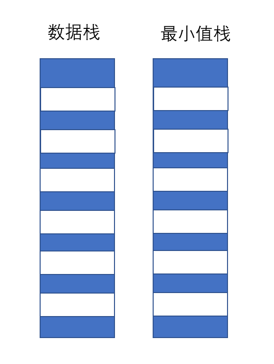
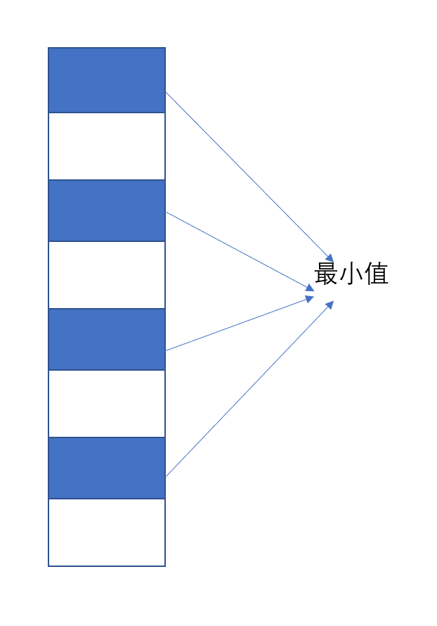

## 栈的相关面试题

[TOC]

### 一、真相！

&emsp;&emsp;我们接触的数据结构中，除了前面我们提及到的链表之外，还有一个栈和队列也是比较简单并且常考的一个数据结构。对于栈来说一方面他有着`先进后出`特性，另一方面也是看在栈在函数执行过程中和递归有着天然的联系，从而备受考官的青睐。说到这里，我们就不得不提及另外一个数据结构——队列，他和栈刚好是相反的，满足`先进后出`的特性。

&emsp;&emsp;说到这里，大家不妨想一想，我们在创建链表的时候，已经提及过有两种创建链表的方式——前插法和后插法。而且我们知道对于前插法，我们的遍历顺序和输出顺序恰好是相反的（“先进后出”）；对于后插法我们的遍历顺序是和输入一致的（“先进先出”）！！发现了什么没有？？！！其实所谓的，栈和队列，不过就是创建方式不同的链表罢了。

### 二、关于栈的热点考题

####（一）创建一个栈

> 题目描述：
>
> 创建一个栈，使得该栈的入栈、出栈以及寻找栈中最小值的时间复杂度全部为$O(1)$

【思路】我们拿到这个题目，二话不说，第一个考虑到就是对于栈来说，由于出栈入栈都是在栈顶进行操作，因此这两项的操作的时间复杂度都是$O(1)$，所以我们的所有注意力应当全部集中在寻找最小值上。

&emsp;&emsp;我们想到查找最小值，那肯定要将栈中所有的数据全部进行遍历，然后得到栈中的最小值，可是这样的操作，一个来回就花费了$O(n)$的时间，这明显是不符合题目中要求的。所以我们需要另想他法，以空间换时间完成题中要求。——既然查找最小值每次都需要遍历，那么我们何不用一块单独的区域记录最小的值呢。这种思路看上去没有问题，可是只使用一块来存储最小值，那么当最小值出栈之后，我们就失去了最小值，这个时候再寻找最小值就变成了遍历整个栈，也达不到题中预期的效果。于是，我们选择使用另外的思路来解决问题

&emsp;&emsp;既然我们使用一块太小，那么我们再建立一个和原来栈一样大的栈，专门用来存储最小值，称为最小值栈，只不过这时候，我们入栈出栈的时候需要将两个栈的栈顶都进行操作。



&emsp;&emsp;当然我们也可以只使用一个栈进行以上的操作，只不过每次入栈的时候，第一个入栈的是真实的数据，第二个入栈的是最小值。



&emsp;&emsp;按照以上的思路，我们写下以下的代码：（使用一个栈）

```c++
class MinStack : public Stack
{
private:
    int Min;
public:
    MinStack();
    ~MinStack();

    void _push(int value);
    
    int find_min();
};

void MinStack::_push(int value)
{
    if (is_empty())
    {
        push(value);
        push(value);
        Min = value;
    }
    else
    {
        push(value);
        Min = value > Min ? Min : value;
        push(Min);
    }
}

int MinStack::find_min()
{
    return top();
}
```

&emsp;&emsp;使用两个栈来进行操作：

```c++
class MinStack_Two
{
private:
    Stack* normal_stack;
    Stack* min_stack;

public:
    MinStack_Two();
    ~MinStack_Two();

    void push(int value);
    int pop();
    int get_Min();
};

void MinStack_Two::push(int value)
{
    if (normal_stack -> is_empty() && min_stack -> is_empty())
    {
        normal_stack -> push(value);
        min_stack -> push(value);
    }
    else
    {
        int min = min_stack -> top();

        normal_stack -> push(value);
        min = value > min ? min : value;
        min_stack -> push(min);
    }
}

int MinStack_Two::get_Min()
{
    if (!(min_stack -> is_empty()))
        return min_stack -> top();
    else
        return -1;
}

int MinStack_Two::pop()
{
    if (!(normal_stack -> is_empty()) && !(min_stack -> is_empty()))
    {
        min_stack -> pop();
        return normal_stack -> pop();
    }
    else 
        return -1;
}
```

#### （二）使用两个栈创建一个队列

> 题目描述：
>
> 给定两个栈，使用它们完成队列的操作

【思路一】拿到这个题目，我们心里其实还是比较踏实的，因为本来对于栈的性质——“后进先出”，那么我们把数据通过一个栈，然后将这个栈的输出作为另一个栈的输入，这不就是队列的性质了么？但是一般也会有很多种思路，比如，我们将所有的数据全部放在一个栈中之类的。但是我们不拘泥于这些反而会让我们的效率变得更高。那么我们的思路就是：

&emsp;&emsp;对于两个栈$S_1$和$S_2$，我们把$S_1$当作入队列的栈，把$S_2$当作出队列的栈。那么按照以下的算法：

+ 入队列时，直接从$S_1$入栈就好
+ 出队列时，如果$S_2$不为空，那么直接出栈就是结果；如果$S_2$为空，则先将$S_1$中的所有元素全部出栈然后入栈到$S_2$中，再进行出战就是结果

&emsp;&emsp;按照以上的思路可以进行代码书写：

```c++
class Queue_By_Stack
{
private: 
    Stack* in_stack;
    Stack* out_stack;

public: 
    Queue_By_Stack();
    ~Queue_By_Stack();
    void push(int value);
    int  pop();
    int  front();
    bool is_empty();
    int  size();
};

void Queue_By_Stack::push(int value)
{
    in_stack -> push(value);
}

int Queue_By_Stack::pop()
{
    if (is_empty())
        return -1;
    
    if (out_stack -> is_empty())
    {
        while (!(in_stack -> is_empty()))
        {
            out_stack -> push(in_stack -> pop());
        }
    }

    return out_stack -> pop();  
}

int Queue_By_Stack::front()
{
    if (is_empty())
        return -1;
    
    if (out_stack -> is_empty())
    {
        while (!(in_stack -> is_empty()))
        {
            out_stack -> push(in_stack -> pop());
        }
    }
        
    return out_stack -> top();
}

bool Queue_By_Stack::is_empty()
{
    return !(in_stack -> size() + out_stack -> size());
}

int Queue_By_Stack::size()
{
    return in_stack -> size() + out_stack -> size();
}
```

#### （三）使用两个队列创建一个栈

> 题目描述：
>
> 给定两个队列，创建一个栈

【思路】这个是和上面那个使用两个栈创建一个队列的兄弟问题。思路仍然是一样，但是在这里我们不能确定谁是确定的出栈队列，我们的思路是这样：假设有两个队列$Q_1$和$Q_2$

+ 入栈时，我们直接入队列$Q_1$
+ 出栈时，如果队列$Q_1$不为空，那么我们首先将$Q_1$中的数据出队列到$Q_2$ 中，直到只剩下一个元素在$Q_1$ 中，将这个元素直接出队列；当队列$Q_2$为空的时候，那么我们将$Q_2$的数据全部出到$Q_1$中，直到$Q_2$中只剩一个元素，将这个元素出队列。

```c+++
class Stack_By_Queue
{
private: 
    Queue* in_queue;
    Queue* out_queue;
public: 
    Stack_By_Queue();
    ~Stack_By_Queue();
    
    void push(int value);
    int  pop();
    int  top();
    int  size()const;
    bool is_empty();
    void clear();
};

void Stack_By_Queue::push(int value)
{
    in_queue -> push(value);
}

int Stack_By_Queue::pop()
{
    int result = -1;
    int len = 0;
    if (is_empty())
        return result;
    
    if (out_queue -> is_empty())
    {
        len = in_queue -> size();
        while (len > 1)
        {
            out_queue -> push(in_queue -> pop());
            -- len;
        }
        result = in_queue -> pop();
    }
    else if (!(out_queue -> is_empty()))
    {
        len = out_queue -> size();
        while (len > 1)
        {
            in_queue -> push(out_queue -> pop());
            -- len;
        }
        result = out_queue -> pop();
    }

    return result;
}

int Stack_By_Queue::top()
{
    int len = 0;
    if (is_empty())
        return -1;
    
    if (out_queue -> is_empty())
    {
        len = in_queue -> size();
        while (len > 1)
        {
            out_queue -> push(in_queue -> pop());
            -- len;
        }
        return in_queue -> front();
    }

    if (!(out_queue -> is_empty()))
    {
        len = out_queue -> size();
        while (len > 1)
        {
            in_queue -> push(out_queue -> pop());
            -- len;
        }
        return out_queue -> front();
    }

    return 0;
}
```


####（四）元素入栈出栈的合法性

> 题目描述：
>
> 这个题目通常是，给定一个原始序列，然后给定一个输出序列，判断该输出序列是否符合栈出栈的合法性。如（1, 2, 3, 4, 5）的输入一个栈，（4, 5, 3, 2, 1）是否合法？

【思路】在这里，我们实际上是需要借助一个辅助栈来帮助我们模拟这个入栈出栈的过程的。对于辅助栈来说，我们的输入序列在栈为空或者栈顶元素不等于当前出栈的元素的时候，此时我们入栈；如果遇到栈顶元素恰好等于当前出栈的元素，那么栈顶元素出栈并且当前出战序列向后移动一位。

```c++
CheckLegit::CheckLegit(std::vector<int> in_seq, std::vector<int> out_seq) : in_seq(in_seq), out_seq(out_seq)
{
    stack = new Stack();
}

bool CheckLegit::is_invalid()
{
    int index_in = 0, index_out = 0;

    while (index_in < in_seq.size() && index_out < out_seq.size())
    {
        while (index_in < in_seq.size() && (stack -> is_empty() || stack -> top() != out_seq[index_out]))
        {
            stack -> push(in_seq[index_in]);
            ++ index_in;
        }
        while (index_out < out_seq.size() && stack -> top() == out_seq[index_out])
        {
            stack -> pop();
            ++ index_out;
        }
    } 
    
    return stack -> is_empty();
}
```


#### （五）数组实现两个栈

> 题目描述：
>
> 使用一个数组，实现两个栈，使得数组只要有空间就能入栈成功；并且还能有自动扩容的功能

【思路一】这道题拿在手中，思路就很多了。我们在思路一中主要是想到的是，两个栈嘛。那么我们一个栈占用奇数还有一个栈占用偶数。这是这个思路好像又有点问题，当我们一直在奇数栈入栈时候如果奇数栈全部入满，但是偶数栈并没有入多少，那么这个时候虽然数组中有空间，但是奇数栈已经不能入栈成功了。这种思路还是有点问题的。

【思路二】思路二就是，从中间开始向两端生长的两个栈，其实这个也是不能很好的适应长度

【思路三】即然我们已经想到了从中间向两边扩散，那么我们为什么不采用从两边向中间扩散的操作呢，这样一来，我们只要数组有空间就能入栈成功，并且在容量小了的时候我们还能采用扩容的方式缓解压力。

```c++
#define STACK1 0
#define STACK2 1

class Arrray_Stack
{
private:
    int* array;
    int left_last;
    int right_last;
    int capcity;

public:
    Arrray_Stack();
    Arrray_Stack(int capcity);
    ~Arrray_Stack();

    void increase_capcity();
    void push(int flag, int value);
    int  pop(int flag);
    int  size(int flag);
    bool is_empty(int flag);
    bool check_capcity();
};

void Arrray_Stack::push(int flag, int value)
{
    if (check_capcity())
    {
        increase_capcity();
    }
    
    switch (flag)
    {
        case STACK1:
            ++ left_last;
            array[left_last] = value;
            break;
    
        case STACK2:
            -- right_last;
            array[right_last] = value;
            break;
        
        default :
            break;
    }
}

int Arrray_Stack::pop(int flag)
{
    if (is_empty(flag))
        return -1;
    
    int result = 0;
    
    switch (flag)
    {
        case STACK1:
            result = array[left_last --];
            break;

        case STACK2:
            result = array[right_last ++];
            break;

        default:
            break;
    }

    return result;
}

int Arrray_Stack::size(int flag)
{
    int size = 0;

    switch (flag)
    {
        case STACK1:
            size = left_last + 1;
            break;
        
        case STACK2:
            size = capcity - right_last + 1;
            break;
    
        default:
            break;
    }

    return size;
}

bool Arrray_Stack::is_empty(int flag)
{
    bool key = true;

    switch (flag)
    {
        case STACK1:
            key = (left_last == -1);
            break;
        
        case STACK2:
            key = (capcity == right_last);
            break;

        default:
            break;
    }

    return key;
}


bool Arrray_Stack::check_capcity()
{
    return (left_last + 1 == right_last); 
}

void Arrray_Stack::increase_capcity()
{
    int origin_capcity = capcity;

    capcity *= 2;

    int* new_array = new int[capcity];

    for (int i = 0; i <= left_last; ++ i)
        new_array[i] = array[i];
    for (int i = origin_capcity - 1; i >= right_last; -- i)
        new_array[i + origin_capcity] = array[i];

    
    right_last += origin_capcity;
    delete array;
    array = new_array;
}
```

