## 字符串

[TOC]

&emsp;&emsp;在我们的复习过程中，字符串想必是大家最常见的一类试题，他们给我们亲切感，同时又不失挑战性，围绕字符串的有很多良好的思想和相当优秀的算法，接下来我就按照一些常见字符串问题的思路对字符串这一类问题进行一些整理和总结。一般来说对于字符串的题目来说，我们拿到手中一定有解法——蛮力法。但是通常使用蛮力法过于暴力，因此对于字符串的问题一般会有特殊的解决方法。

### 一、背景

&emsp;&emsp;在$C$语言中，对于字符串的结尾处是使用了一个特殊的字符`\0`进行分割的。因此对于$C$语言中，对于字符串的访问极有可能发生越界的错误。因此需要注意。（$P.S.$对于$C$语言中的一个函数$strtok()$，实际上就是将所有的分隔符换成`\0`，然后实际上是破坏了原来的字符串）。为了节省内存，C/C++把常量字符串放到单独的一个内存区域。当几个指针赋值给相同的常量字符串时，它们实际上会指向相同的内存地址。但用常量内存初始化数组，情况却有所不同。

```c++
char str1[] = "hello world!";
char str2[] = "hello world!";

char* str3 = "hello world!";
char* str4 = "hello world!";
```

&emsp;&emsp;以上的$str1$和$str2$不等，$str3$和$str4$相等。

### 二、经典面试题

#### （一）KMP算法

&emsp;&emsp;KMP这个算法实在是太精彩了，以致于我把它放在字符串的第一个题目上。首先我们慢慢的由浅入深的理解这个算法。

&emsp;&emsp;首先我们首先明确一下，这个算法是使用解决的字符串匹配的一个算法。

> 问题描述：
>
> 假设有一个字符串$str$和模式$pat$，判断$str$中是否含有$pat$

#####1.问题提出与思考

&emsp;&emsp;我们来进行举例子，假设$str=BBC ABCDAB ABCDABCDABDE​$和$pat = ABCDABD​$。我们首先以最普通的方式来尝试解决这个问题。

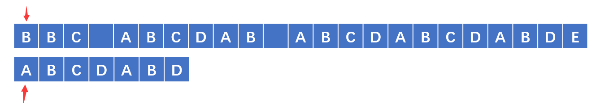

&emsp;&emsp;在以上的图中，我们发现$str$和$pat$的不一致，那么我们将$pat$向后移动一格，得到以下的图。

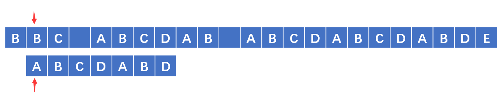

&emsp;&emsp;直到移动到能够匹配的位置上去，得到以下的图片中的情况：

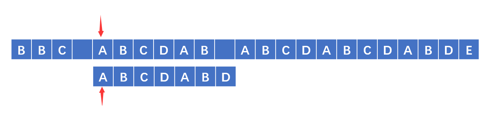

&emsp;&emsp;能够匹配到，那么就开始进行匹配，发现最后一个并没有匹配成功：

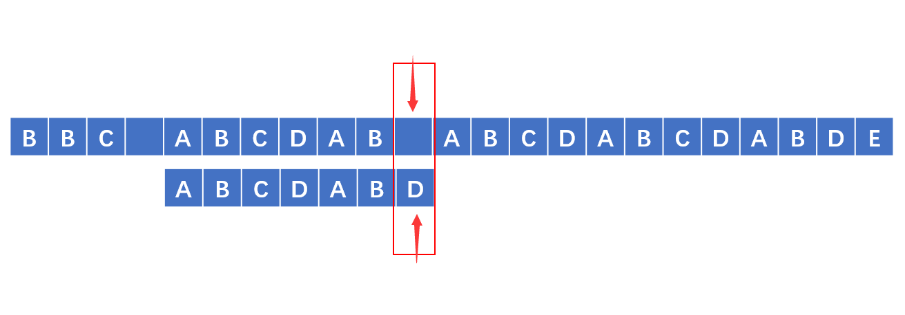

&emsp;&emsp;遇到这种情况，对于蛮力法，我们可能就会将$pat$向后移动一格，然后继续匹配。

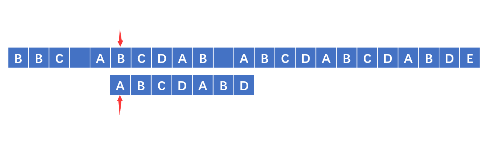

&emsp;&emsp;但是！我们这样进行了多余的比较，实际上正是这个多余的比较让我们的算法显得臃肿而时间复杂。因此我们现在的目的就是，利用我们已经比较过的字符，看能否让我们避免以上的多余的比较。

&emsp;&emsp;说到这里，我们思考一个问题：<font color="red">因为我们需要利用到字符串之前匹配的结果，而这些匹配的字符是既存在于str中也存在于pat中的！也就是说，我们只要弄清楚pat本身的情况，那么我就能避免无谓的移动。</font>那么怎样弄清楚$pat$本身的情况，又该弄清楚$pat$的什么情况呢？

&emsp;&emsp;事实上，我们先直观的思考一下，如果要避免pat避免无效移动，那么我们移动的格数，应该是和pat本身 有关，并且是和本身的`重复`有关。那以上的图来说，我们在以下的图中发现失配了，那么我们想到的是：在pat中如果前面也存在和失配字符的前一个字符匹配的字符的话，那么就移动相应的格数。


&emsp;&emsp;例如，下面这个匹配——我们失配的前一个字符是$B$，而且我们发现刚好在$pat$中也存在一个$AB$刚好和失配前的两个匹配，因此我们直接将$pat$后移动4格。得到下图：

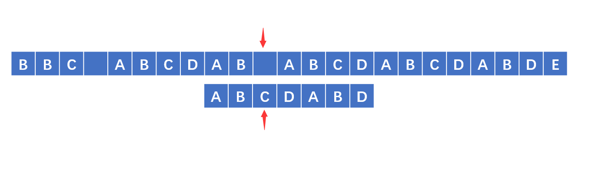

&emsp;&emsp;从以上的过程来看，我们已经避免了无谓的移动，因此我们现在的重点就是怎么做才能得到我们刚才在上面所说的那个本身的性质。

##### 2.前缀后缀的引入

&emsp;&emsp;上一节，我们知道了只要研究$pat$字串本身的`重复`情况，就能直接避免无谓的移动。那么怎么确定这个`重复`的情况呢？我们首先引入前缀、后缀的概念。

【定义】前缀：一个字符串的前缀就是除开最后一个字符外的全部头部组合

【定义】后缀：一个字符串的后缀就是除开第一个字符外的全部尾部组合

> 例如：对于字符串$ABACAB$
>
> 前缀是$A$, $AB$, $ABA$, $ABAC$, $ABACA$
>
> 后缀是$B$, $AB$, $CAB$, $ACAB$, $BACAB$

&emsp;&emsp;我们仔细想一想，我们研究这些前缀，后缀。如果我们能够找到相同的前缀和后缀，那么不就是我们之前所说的`重复`问题？从以上来看，这个$pat$的最长匹配的前后缀是$AB$。也就是说，对于这个$pat$，如果在该模式的后一个字符失配，那么我们可以移动到两个匹配的位置，我们移动的距离是：<span id="jump"><font color="red">已经匹配的长度 - 前后缀匹配的最长长度。</font></span>

##### 3.前后缀相同的最大长度

&emsp;&emsp;既然有以上的理论作为支撑，那么我们现在就是直接寻找最大的前后缀匹配的字符串。根据以上关于前后缀的定义，我们可以算出以下的这个表。

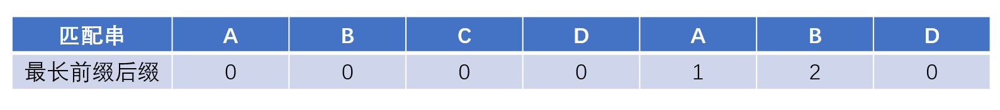

&emsp;&emsp;有了这个表，我们就可以通过以上的移动[规则](#jump)。只要遇到失配的字符，我我们就查看该字符的前一个最长前后缀，用已经匹配的长度减去表中前一个字符的最长前后缀就是需要移动的距离。

##### 4.next数组

&emsp;&emsp;那么，我们到上一节，按理说就应该完事儿了，那么我们为什么还要整出一个$next$数组？我们首先看看，具体的$next$数组是怎样的——

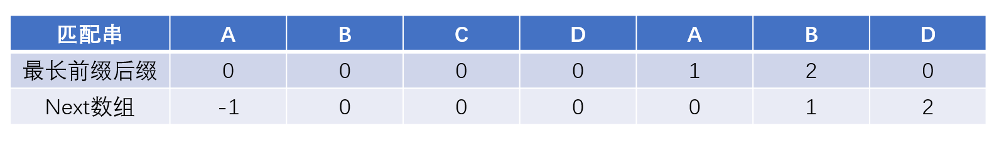

&emsp;&emsp;其实不难发现，我们的$next$数组实际上就是将我们之前求的最长前后缀整体向后移动一位，并且将数组中的第一个值赋值为$-1$。那么我们为什么还需要使用$next$呢？实际上我们直接使用以上的最长前后缀也是没有什么问题的。但是一般来说我们更加倾向于使用当前匹配的字符。

> 使用最长前后缀：已经匹配的长度 - 前一个字符串的最长前后缀数组的值
>
> 使用$next$数组：当前匹配的下标（从零开始） - 当前位置的$next$数组值
>
> 实际上以上两个计算式子是一样的，被减数本来就相等，同时对于$next$数组和最长前后缀的前一个也是自然相等的，所以两个方法没有什么本质的区别。

##### 5.next数组的计算

&emsp;&emsp;以上说了那么多，现在的问题就是我们怎样计算$next$数组。好，如果说刚才的$KMP$让大家看的还不觉得这个算法有多么精彩，那么接下来的操作就是真正的精彩部分！

&emsp;&emsp;事实上，在这个$next$数组的计算过程中，也是采用了$KMP$的思想，只不过是自己和自己进行匹配。首先对于$next$来说，第一个元素就直接赋值为$-1$。接下来的操作就是使用两个变量。

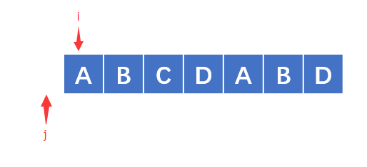

> 如果他们对应的值相等，那么就在前一个的$next$数组值的基础上$+1$就好。如果不等就相当于我们之前在$KMP$中所说的失配！！所以我们移动的位置就是当前下标 - 当前下标的$next$值（$j - next[j]$）。所以新的位置是$j - (j - next[j])$，所以$j$的新下标为$j = next[j]​$。

&emsp;&emsp;我们根据以上的思路写出如下代码：

```c++
int* get_next(std::string pattern)
{
    int len_pat = pattern.size();

    if (len_pat < 0)
        return nullptr;

    int* result = new int[len_pat];

    int i = 0, j = -1;

    while (j < len_pat)
    {
        if (j == -1 || pattern[i] == pattern[j])
        {
            result[i] = j;
            ++ i; 
            ++ j; 
        }
        else
            j = result[j];
    }

    return result;
}

```

##### 6.KMP算法实现

&emsp;&emsp;整体的$KMP$算法为：

```c++
int KMP_algorithm(std::string pattern, std::string str)
{
    int* next = get_next(pattern);

    int i = 0, j = -1;
    int len_pat = pattern.size();
    int len_str = str.size();

    while (i < len_str && j < len_pat)
    {
        if (j == -1 || pattern[j] == str[i])
        {
            ++ j;
            ++ i;
        }
        else 
            j = next[j];
    }

    if (j == len_pat)
        return i - j;
    
    return -1;
}
```

##### 7.next数组优化

&emsp;&emsp;以上的这几部貌似已经很清楚明了了，而且对于整个过程我们似乎没有找到任何不妥之处，但是还有一些小小令人不安的乌云。

> ”在晴朗的天空的远处，仍然有两朵令人不安的乌云“
>
> ​												——Lord Kelvin

&emsp;&emsp;我们正在酣畅淋漓的时候，我们遇到了这个$pat$ ——$abab$：根据我们的$next$数组的算法，我们计算出来的结果如下：

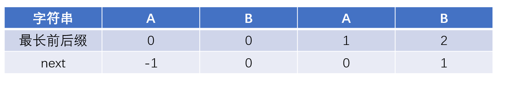

&emsp;&emsp;在进行匹配$str$为$abacababc$的时候有以下的操作：

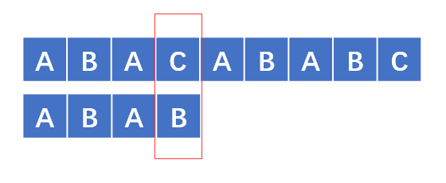

&emsp;&emsp;如果按照之前的next数组，我们需要移动的格数为$3 - next[3] = 2$，移动之后变成以下的样子

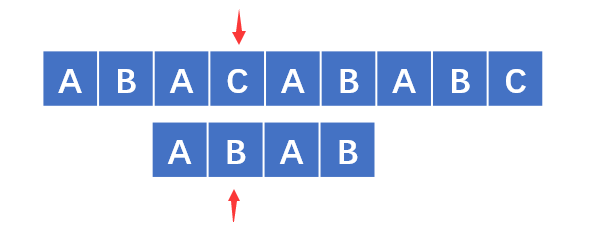

&emsp;&emsp;这样子看起来，还是不匹配！这本来也不算什么问题，但是正是由于$pat$字符串的特殊性，让我们产生了这个不必要的移动。那么我们研究一下，以上的问题究竟出现在什么地方呢？

&emsp;&emsp;子细分析一下，按照$KMP$算法，我们$pat[j] != str[i]$， 就该换成$pat[next[j]]$ 和$str[i]$进行匹配，但是注意，正是由于在$pat$中，$pat[j]$和$pat[next[j]]$是相等的！所以导致我们这次的移动是不必要的移动。因此我们只要遇到这种情况，那么我们就继续递归下去，直到不相等为止。我们优化后的$next$数组如下：

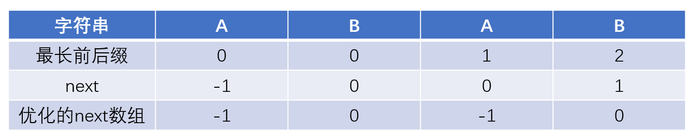

&emsp;&emsp;按照我们新的优化过的$next​$数组进行$KMP​$算法：

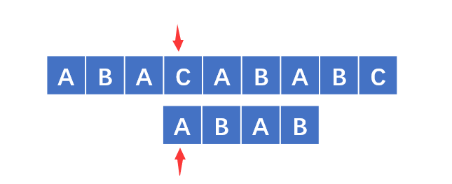

&emsp;&emsp;这样移动之后的效率就高出了很多。

&emsp;&emsp;接下来我们代码实现刚才的优化$next​$数组：

```c++
int* get_next(std::stirng pat)
{
    int len_pat = pat.size();
    if (len_pat < 0)
        return nullptr;
    
    int* result = new int[len_pat + 1];
    int i = 0, j = -1;
    result[0] = -1;
    
    while (j < len_pat)
    {
        if (j == -1 || pat[i] == pat[j])
        {
            ++ i;
            ++ j;
            if (pat[i] != pat[j])
            {
                next[i] = j;
            }
            else
            {
                next[i] = next[j];
            }
        }
        else
        {
            j = next[j];
        }
    }
    return result;
}
```

<https://www.cnblogs.com/ZuoAndFutureGirl/p/9028287.html>

####（二）回文串字符问题（Manacher）

&emsp;&emsp;作为一个相当经典的问题，我把它放在字符串的第二个实现当中。这个问题是那种看起来不是很大难度，一下就有思路，但是我们第一想到的就是蛮力法解决这个个问题。首先就是枚举这个字符串的所有字串，然后再进行判断这个子字符串是否是回文串，这样的时间复杂度是$O(n^3)$，这个时间复杂度显得有点过于高，不甚合理；或者采用枚举回文串的中点的方法来进行判断，但是这样还是得判断原字符串长度的奇偶问题，最主要的还是这样的时间复杂度还是$O(n^2)$，还是不是很让人满意的。

&emsp;&emsp;难道就穷途末路了么？$Manacher$提出的一种算法就完美解决了这个问题。那么它究竟神在哪里呢，我们来仔细看看——

##### 1.解决恼人的奇偶问题

&emsp;&emsp;上面我们谈到再进行回文串判断的时候，有一个很眼中的问题摆在我们眼前，甚至可以说是一只“拦路虎”——字符串长度的奇偶问题，因为我们对奇数字符串的处理和对偶数字符串的处理是不一样的。对于偶数的字符串我们可能需要遇到他们的中点实际上是两个字符串的中间！这就比较复杂了。

&emsp;&emsp;但是万能的$Manacher$提出了一种统一解决奇偶数据的方案。思路也很简单，就是利用这个式子$2n+1$恒为奇数来的。也就是说我们只要在原字符串中添加另外$n+1$个辅助字符，那么我们判断起来就统一了，一般来说我们都是使用$\#$来作为那个辅助字符。而且正好将$\#$插入到源字符串的空间当中，就解决了我们的奇偶问题。

> 例如：
>
> 原字符串：abba
>
> 处理之后：#a#b#b#a#

##### 2.计算Len数组

&emsp;&emsp;解决了以上的这些问题之后，我们接下来要做的工作就是求一个数组$Len$，$Len[i]$的含义表示以$T[i]$为中心的关于$T[i]$对称的字符串的长度。

|       |  #   |  a   |  #   |  b   |  #   |  b   |  #   |  a   |  #   |
| :---: | :--: | :--: | :--: | :--: | :--: | :--: | :--: | :--: | :--: |
| $Len$ |  0   |  1   |  0   |  1   |  4   |  1   |  0   |  1   |  0   |

&emsp;&emsp;这个$Len$数组还有一个性质，即$Len[i]$的长度就是该回文串在原字符串中的长度。

> 这里简单证明一下：
>
> 在预处理之后的字符串中，关于$T[i]$对称的字符串的长度为$Len[i]$，也就是说在处理后的字符串中回文串的长度为$2*Len[i]+1$，通过观察，回文串中的辅助字符总是比原字符多一个，因此$Len[i]$就是该回文串在源字符串中的长度。

#####3.已经算过的坚决不再算

&emsp;&emsp;以上我们了解了$Len$数组的具体含义，那么我么接下来要做的就是计算$Len$数组的值。这个值应该怎么计算呢？我们要利用一切我们计算完的结果来完成最终的计算。

&emsp;&emsp;首先我们必须明确，在计算$Len[i]$的时候，我们已经将所有的$Len[j] (0 \lt j \lt i)$全部计算完成了。那么我们该怎样利用计算出来的结果进一步优化我们的计算过程呢？

######（1）$i < Right\_Bondary$

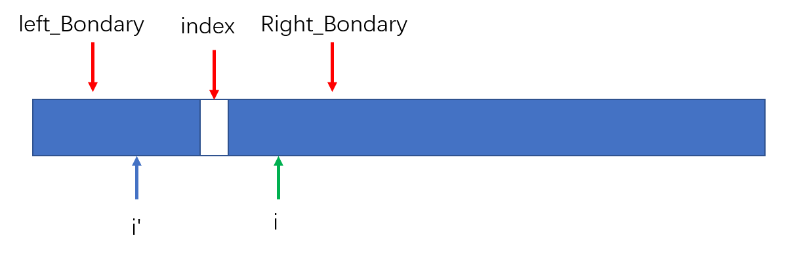

&emsp;&emsp;以上图中的$index$表示已经求出的最大长度的下标。其中$left\_bondary$和$right\_bondary$分别是他的左右边界。现在要求的是$Len[i]$，$i\prime$是$i$关于$index$的镜像点。只有在$Len[i\prime]\lt Right\_Bondary - i$的时候才能直接将$Len[i\prime]$的值赋值给$Len[i]$。其他的情况就需要继续计算。

###### （2）$i\ge Right\_Bondary$

&emsp;&emsp;剩下的就需要继续计算。计算完成之后需要更新$index$和$right\_Bondary$的值。


#### （三）判断中位数

#### （四）字符串替换

