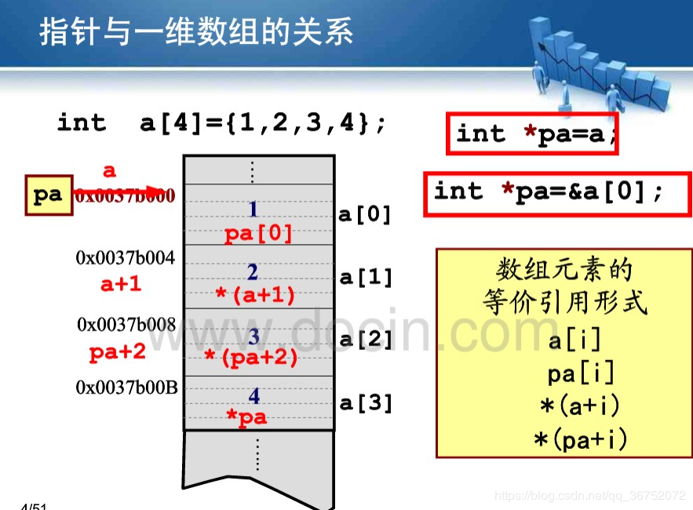

[TOC]

&emsp;&emsp;大道理什么的我已经不想多讲，直接上一些让自己重新理解问题的笔记才是硬核之事。今天我写的代码是排序问题，这是一个很古老，也是算法开课绕不开的问题，有很多种形态各样的排序算法——冒泡排序、插入排序、归并排序，快速排序、堆排序、希尔排序等等。
&emsp;&emsp;今天我首先想接触的是插入排序和归并排序两种。首先来看一下插入排序——

### 插入排序
&emsp;&emsp;主要思路是将一个新的数据插入到一个已经排好序的数组中，然后依次进行最终完成排序，这个算法的时间复杂度是$O(n^2)$，主要的问题存在于，由于数组是连续的空间，因此插入操作，实际上是两个相邻的数组之间比较大小然后交换位置的过程的重复。
——我先写出伪代码
```
## 输入：数组A
## 输出：排好序的数组A
for i in 2 to n:
    for j in i to 0:
        if A[j] < A[j - 1] ## 根据结果从大到小还是从小到大决定大于小于号
            swap(A[j - 1], A[j])
```
以下是插入排序的C++代码实现：
```c++
    #include <iostream>
    #define Length(A, B) (sizeof(A) / sizeof(B))
    void insert_sort(int *, int);
    void swap(int &, int &);
    void display(int *, int);

    int main(int argc, char const *argv[])
    {
        int A[] = {3, 2, 5, 4, 8, 7, 6};
        int length = Length(A, int);

        display(A, length);
        insert_sort(A, length);

        display(A, length);
        return 0;
    }

    void insert_sort(int A[], int length)
    {
        if (A == nullptr)
            return;

        if (length <= 0)
            return;

        for (int i = 1; i < length; ++ i)
        {
            for (int j = i; j > 0; --j)
            {
                if (A[j] > A[j - 1])
                    swap(A[j], A[j - 1]);
            }
        }
    }

    void swap(int &num1, int &num2)
    {
        int temp_num = num1;
        num1 = num2;
        num2 = temp_num;
    }

    void display(int A[], int length)
    {
        for (int i = 0; i < length; ++i)
        {
            std::cout << A[i] <<std::endl;
        }
    }
```
> P.S. 在这里我强调一个小问题，就是在计算给定数组的长度的时候，我们采用的方法是这样的
```c++
int A[] = {a1, ..., an};
int length = sizeof(A) / sizeof(A[0]);
```
但是如果，我们的数组是一个参数传来的，那么这样做就会出现问题：
```c++
int A[] = {a1, ..., an};
int length(int A[])
{
    if (A == nullptr)    return 0;
    return sizeof(A) / sizeof(A[0]);
}
```
实际上，上述第一段代码的运行结果是n， 而第二段代码的运行结果是2。那么这是怎么回事呢？——实际上，对于数组而言，数组名可以看成是指针，但是他却和指针并不能完全等同起来。在c++中进行参数传递，数组名传入的实际上是自己的首地址，因此此时进行sizeof得到的其实是整型数组的长度即8，然后再取除以sizeof(int)这样得到的结果就是2。


### 归并排序
&emsp;&emsp;归并排序算是一个非常典型的分治法的具体使用案例了，总体上说来就是将原数组分成长度相等的两部分，然后分别对他们进行排序，最后将排好序的两个子序列进行合并，（快排是将数组按大小分成两部分，然后进行迭代），依次递归程序，就实现了排序算法。
&emsp;&emsp;归并排序的时间复杂度满足以下的时间递推式：
$$T(n) = 2T(\dfrac{n}{2}) + O(n)$$
&emsp;&emsp;因此他的时间复杂度为$O(n\lg n)$
——我先写出伪代码

```python
## 输入：数组A，数组的起始位置，数组长度length
## 输出：排好序的数组A

def merge_sort(A, left, length):
	interval = length / 2
	merge_sort(A, left, interval)
	merge_sort(A, left + interval, length - interval)
	
	merge(A_left, A_right)
```
&emsp;&emsp;以下我写出他的c++代码实现：
```c++
void merge_sort(int A[], int left, int length)
{
	if (length == 1 || A == nullptr)
		return;

	int interval = length / 2;
	/***
	*	将原数组等距离二分
	*/
	int n_left = left, n_right = left + interval;
	merge_sort(A, n_left, interval);
	merge_sort(A, n_right, length - interval);


	/***
	*	将原数组二分完成之后，再对两部分已排好序的数组进行合并
	*/
	
	int *temp_array = new int[length]; 

	int count = 0;
	
	/***
	*	构造临时数组，先存在临时数组，然后再复制给原来的数组
	*/
	while (n_right < length + left && n_left < interval + left)
	{
		temp_array[count ++] = A[n_left] <= A[n_right] ? A[n_left ++] : A[n_right ++];
	}

	/***
	*	若左边数组的数组已经完成合并，右边的数组还未合并完
	*	这样就可以直接将临时数组的前count个数复制回原来的数组
	*/
	if (n_left == interval + left && n_right <= left + length)
	{
		for (int i = 0; i < count; ++ i)
		{
			A[i + left] = temp_array[i];
		}
	}

	/***
	*	若右边数组的数组已经完成合并，左边的数组还未合并完
	*	这样就先将左边的最大数先放到原数组的右边，
	*	然后将临时数组的前count个数复制回原来的数组
	*/
	if (n_left <= interval + left && n_right == left + length)
	{
		for (int i = left + interval - 1; i >= n_left; -- i)
		{
			A[length + i - interval] = A[i];
		}

		for (int i = 0; i < count; ++ i)
		{
			A[i + left] = temp_array[i];
		}
	}

	delete []temp_array;
}
```

&emsp;&emsp;P.S.还有一个版本的归并排序，只是它的参数需要的少一点，我也把它贴在下面：
```c++
void merge_sort(int A[], int length)
{
	if (A == nullptr || length <= 1)
		return;

	int interval = length / 2;

	merge_sort(A, interval);
	merge_sort(A + interval, length - interval);

	int left = 0, right = interval;
	int *temp_array = new int[length];
	int count = 0;

	while (left < interval && right < length)
		temp_array[count ++] = A[left] <= A[right] ? A[left ++] : A[right ++];

	if (left == interval && right <= length)
	{
		for (int i = 0; i < count; ++ i)
		{
			A[i] = temp_array[i];
		}
	}

	if (right == length && left <= interval)
	{
		for (int i = interval - 1; i >= left ; -- i)
		{
			A[i + length - interval] = A[i];
		}

		for (int i = 0; i < count; ++ i)
		{
			A[i] = temp_array[i];
		}
	}

	delete []temp_array;
}
```
&emsp;&emsp;思路同上，那么接下来我依然是进行总结。
>总体来说，归并排序的思路很清晰，很明了，但为什么我的代码还是写了这么久？！原因很长时间是因为我再处理边界的时候除了问题，没有想明白一个边界问题。因此在这里我记录下来，du对于边界问题一定要仔细考虑，千万不可随意书写，到最后debug太难受了。
> P.S.其次，我想说明，对于缺少左边界参数归并版本，实际上就是将数组的偏移直接作为参数传入函数进行处理，这样就能直接将左边界写死，完成代码的实现。另外通过指针访问数组，实际上只需要在首地址的基础之上加上偏移，然后解引用便获得相应下标得值。eg:A[] = {1, 2, 3, 4, 5}想要访问A[3]得途径有A[3]、\*(A + 3)——
>