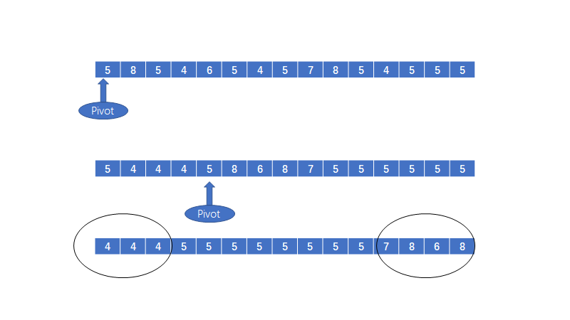

[TOC]
&emsp;&emsp;闲话休说，自从前几天写了排序问题中的两个排序之后。然后我又开始了快排代码的研究当中。当时学习的时候学的十分粗糙，今天重新来总结总结，把一些关于快排的问题进行总体上的描述。主要的内容有以下的这些：
### 一、快排的三种选择基准的方式
#### 1.边界基准法
&emsp;&emsp;这种方式最简单，就是直接使用原数组中的第一个元素或者最后一个元素当作快排的基准。详细见以下的代码：
```c++
int select_pivot(int *array, int left, int length)
{
    return array[left];
}
```
&emsp;&emsp;这样的基准选择方法在待排列数据是随机的时候效率是不错的，但是当待排序的数列是有序的，也就是说，我们每次的选择都是最倒霉的，要么是全数组中最小的，要么是全数组中最大的。此时快排退化成为冒泡排序。

#### 2.随机基准法
&emsp;&emsp;基于以上的我们可能成为最倒霉的“倒霉蛋”，我们采取随机的方式来选取基准，此时我们就与输入数组的序列无关了。随机基准法的代码如下：
```c++
int select_pivot_random(int *array, int left, int length)
{
    srand((unsigned)time(0));
    int index = rand() % length + left;

    swap(array[left], array[index]);

    return array[left];
}
```
&emsp;&emsp;虽然说，随机基准法解决了绝大部分的基准选取问题，但是我们仍然有望成为那个“倒霉蛋”。虽然每次取到最小值的概率比较小，但是理论上还是存在这种可能性，而且一旦存在这种情况就直接退化为冒泡排序，时间复杂度太高。概率比较小，但是理论上还是存在这种可能性，而且一旦存在这种情况就直接退化为冒泡排序，时间复杂度太高。
#### 3. 三数取中基准法
&emsp;&emsp;为了从理论上消除以上随机基准存在的最后一点不好的情况，我们采用的是三数取中基准法，完全解决这个问题，这样就算最坏的情况也是分成1和n - 2号，一般的想法就是随机取出三个数，然后取中间的那个数作为基准，但是在这种情况之下，随机已经不是那么重要了，我们通常采用的方法是将左端、右端和中间的三个数取他们的中间值，代码如下：
```c++

int select_pivot_medium(int *array, int left, int right)
{
    int half = left + (right - left + 1) / 2;

    if (array[left] > array[right])
        swap(array[left], array[right]);
    if (array[half] > array[right])
        swap(array[half], array[right]);
    if (array[left] < array[half])
        swap(array[left], array[half]);
        
    return array[left];
}
```
&emsp;&emsp;以上的代码实际上就是先将三数中的最大值放到最右边，然后把剩下的较大的那一个数放到左端上就好。
&emsp;&emsp;为了从理论上消除以上随机基准存在的最后一点不好的情况，我们采用的是三数取中基准法，完全解决这个问题，这样就算最坏的情况也是分成1和n - 2号，一般的想法就是随机取出三个数，然后取中间的那个数作为基准，但是在这种情况之下，随机已经不是那么重要了，我们通常采用的方法是将左端、右端和中间的三个数取他们的中间值，代码如下：

```c++

int  select_pivot_medium(int *array, int left, int right)
{
    int half = left + (right - left + 1) / 2;

    if (array[left] > array[right])
        swap(array[left], array[right]);
    if (array[half] > array[right])
        swap(array[half], array[right]);
    if (array[left] < array[half])
        swap(array[left], array[half]);
    return array[left];
}
```
&emsp;&emsp;以上的代码实际上就是先将三数中的最大值放到最右边，然后把剩下的较大的那一个数放到左端上就好。

### 二、几种快排的优化
#### 1. 当排序规模较小的时候采用插入排序

&emsp;&emsp;其实对于很小的数组或者部分有序的数组来说，插入排序的效率其实要比快排的效率高一些。因此我们可以考虑当排序规模小到一定程度的时候，我们可以使用插入排序代替快排，由此可以提高效率。

&emsp;&emsp;一般我们选择序列长度在5~20之间的数据，在这里我们选择的是10。代码如下：

```c++
if (right - left + 1 < 10)
{
	insert_sort(array, left, right);
	return;
}
```

#### 2. 在一次分割结束之后，可以把key相等的元素在一起没下次分割，就不分割key相同的元素

&emsp;&emsp;这个优化主要是针对那些在数组中出现了大量的重复元素的情况的优化。思路就是将与基准相等的数字首先移动到数组的两端。之后再将两端的相等的数据全部集中到中间。



&emsp;&emsp;这样就大大降低了对重复元素的处理。具体的代码如下：

```c++
/**
 * 这个方法主要是用于解决在数组中存在大量的重复数据的问题
 * 主要思路就是在前后两个指针相对移动的时候顺便处理和pivot相等的数据
 * 1. 将他们移动到数组的两端
 * 2. 将他们从数组两端移动到中间
 * 3. 对剩下的数据进行快排
 * **/
int partition_optimize(int *array, int left, int right, int& left_len, int& right_len)
{
	int pivot = select_pivot_medium(array, left, right);

	int first = left, last = right;
	left_len = 0;
	right_len = 0;
	int left_item = left, right_item = right;

	
	while (left_item < right_item)
	{
		while (left_item < right_item && array[right_item] >= pivot)
		{
			if (array[right_item] == pivot) 
			{
				swap(array[right_item], array[right]);
				-- right;
				++ right_len;
			}
			-- right_item;
		}
		array[left_item] = array[right_item];

		while (left_item < right_item && array[left_item] <= pivot)
		{	
			if (array[left_item] == pivot)
			{
				swap(array[left], array[left_item]);
				++ left;
				++ left_len;
			}
			++ left_item;
		}
		array[right_item] = array[left_item];
	}
	array[left_item] = pivot;

	int low = first, high = left_item - 1;
	while (low < left && array[high] != pivot)
	{
		swap(array[low], array[high]);
		++ low;
		-- high;
	}

	low = left_item + 1;
	high = last;
	while (high > right && array[low] != pivot)
	{
		swap(array[low], array[high]);
		++ low;
		-- high;
	}
	return left_item;
}
```


### 三、非递归方式实现快排

&emsp;&emsp;我们知道对于递归的内部实现，就是自己调用自己，多半是使用栈这个数据结构来实现的，因此我们可以使用栈来替代递归程序。进行非递归快排的代码。主要思路就是模拟递归的实现。具体的代码实现如下：

```c++
/**
 *	其实真正的排序是由partition完成的
 *	栈的数据结构只是提供了一个空间
 * */
void no_recurrence_quick_sort(int *array, int left, int right)
{
	std::stack<int> stack;
	stack.push(right);
	stack.push(left);

	while (! stack.empty())
	{
		left = stack.top();
		stack.pop();
		right = stack.top();
		stack.pop();
		
		if (left < right)
		{
			int middle = partition(array, left, right);
			if (left < middle - 1)
			{
				stack.push(middle - 1);
				stack.push(left);
			}
			if (right > middle + 1)
			{
				stack.push(right);
				stack.push(middle + 1);
			}
		}
	}
}
```